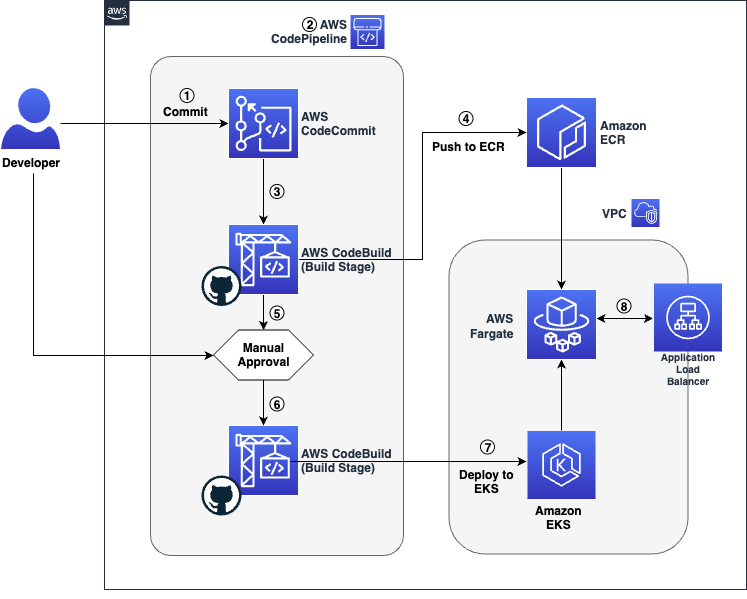

# bg.hackathon.alphahackers

Este es el repositorio del proyecto **bg.hackathon.alphahackers**, desarrollado para la competencia organizada por Banco Guayaquil. El objetivo es crear el backend de un sistema de **marketplace** para pymes, llamado **PymeGo**, utilizando **.NET 9** con un enfoque de **Domain-Driven Design (DDD)** y consumiendo servicios a través de **AWS API Gateway**.

## Índice
- [Descripción General](#descripción-general)
- [Arquitectura](#arquitectura)
- [Tecnologías Utilizadas](#tecnologías-utilizadas)
- [Requisitos Previos](#requisitos-previos)
- [Configuración del Proyecto](#configuración-del-proyecto)
- [Estructura del Proyecto](#estructura-del-proyecto)
- [Ejecutar la Aplicación](#ejecutar-la-aplicación)
- [Pruebas](#pruebas)
- [Contribución](#contribución)
- [Licencia](#licencia)

---

## Descripción General

**bg.hackathon.alphahackers** es el API Backend para la plataforma **PymeGo**, que busca:
1. Proveer servicios de venta y distribución de productos de diversas pymes.
2. Centralizar y exponer la lógica de negocio mediante un diseño enfocado en DDD.
3. Integrarse con servicios externos a través de Amazon Web Services (AWS) **API Gateway**.

La plataforma **PymeGo** busca ser un canal seguro y robusto para que los emprendimientos puedan vender y gestionar sus productos de manera eficaz.

---



Arquitectura del flujo de trabajo.

## Arquitectura

Este proyecto se basa en **Domain-Driven Design (DDD)**, utilizando patrones típicos de esta metodología:

- **Capa de Dominio (Domain):** Encierra las entidades, agregados y lógica de negocio principal.
- **Capa de Aplicación (Application):** Orquesta la lógica de la aplicación y coordina entre el dominio y las interfaces.
- **Capa de Infraestructura (Infrastructure):** Maneja la persistencia de datos, la comunicación con servicios externos (en este caso, AWS API Gateway) y la configuración de la aplicación.
- **Capa de Presentación / API (Presentation / API):** Expone los endpoints para interactuar con PymeGo y gestiona las peticiones y respuestas HTTP.

Además, el proyecto aprovecha **AWS API Gateway** para comunicarse con servicios externos (por ejemplo, para procesamiento de pagos o notificaciones), manteniendo así una arquitectura escalable y desacoplada.

---

## Tecnologías Utilizadas

- **.NET 9**: Framework de Microsoft para construir aplicaciones robustas y escalables.
- **C#**: Lenguaje principal de implementación.
- **Domain-Driven Design (DDD)**: Patrón de arquitectura para manejar la complejidad del negocio.
- **AWS API Gateway**: Servicio de AWS para exponer y consumir APIs de manera segura y escalable.
- **Entity Framework Core (opcional)**: Para acceso a datos, si corresponde.
- **Swagger/OpenAPI**: Para documentar y probar la API.
- **xUnit / NUnit / MSTest (o cualquiera similar)**: Para pruebas unitarias e integradas.

---

## Requisitos Previos

1. **.NET 9 SDK** instalado.
2. Editor de código o IDE compatible con .NET (Visual Studio, Visual Studio Code, Rider, etc.).
3. Acceso y credenciales de AWS (si vas a probar integraciones reales con AWS API Gateway).
4. (Opcional) **Docker** si deseas contenedizar el servicio.

---

## Configuración del Proyecto

1. **Clonar el repositorio**:

   ```bash
   git clone https://github.com/Ksantacr/HackatonBG2025.git
   cd bg.hackathon.alphahackers
   ```

2. **Configurar variables de entorno** (si aplica):
   - Configurar las credenciales de AWS (por ejemplo en `.env`, o variables de entorno propias del sistema):
     - `AWS_ACCESS_KEY_ID`
     - `AWS_SECRET_ACCESS_KEY`
     - `AWS_REGION`
   - URL o ARN del AWS API Gateway que vayas a consumir:
     - `AWS_API_GATEWAY_URL`

3. **Instalar dependencias**:
   Si usas Visual Studio, estas se restauran automáticamente al abrir la solución.
   Desde la CLI, en la carpeta raíz del proyecto:

   ```bash
   dotnet restore
   ```

---

## Estructura del Proyecto

A modo de ejemplo, la estructura podría verse así:

```
.
├── src
│   ├── bg.hackathon.alphahackers.Api          # Proyecto principal de la API
│   ├── bg.hackathon.alphahackers.Application  # Lógica de aplicación
│   ├── bg.hackathon.alphahackers.Domain       # Entidades y reglas de negocio
│   └── bg.hackathon.alphahackers.Infrastructure # Integraciones con base de datos, AWS, etc.
│
├── tests
│   ├── bg.hackathon.alphahackers.Tests        # Pruebas unitarias e integradas
│
├── README.md
└── ... archivos de configuración ...
```

---

## Ejecutar la Aplicación

1. **Compilar el proyecto**:

   ```bash
   dotnet build
   ```

2. **Ejecutar la aplicación**:

   ```bash
   dotnet run --project ./src/bg.hackathon.alphahackers.Api/bg.hackathon.alphahackers.Api.csproj
   ```

3. **Verificar la API**:
   - La aplicación normalmente se expone en `http://localhost:5000` o `https://localhost:7000`.
   - Abre tu navegador o una herramienta como Postman e ingresa a `http://localhost:5000/swagger` para visualizar la documentación **Swagger**.

---

## Pruebas

Para ejecutar los tests unitarios:

```bash
   dotnet test
```

Se ejecutarán todos los proyectos de prueba que se encuentren en la carpeta `tests`.

---

## Contribución

1. Haz un **fork** del repositorio.
2. Crea tu **feature branch** (`git checkout -b feature/nueva-funcionalidad`).
3. Realiza los **commits** necesarios (`git commit -m 'Agregando nueva funcionalidad'`).
4. Sube tu branch (`git push origin feature/nueva-funcionalidad`).
5. Abre un **Pull Request** en este repositorio.

---

## Licencia

Este proyecto se desarrolla para la competencia interna del **Banco Guayaquil**, por lo que su licencia y uso pueden ser restringidos. Revisa los lineamientos de la competencia para más detalles o contacta a los organizadores para información adicional.

---

¡Gracias por tu interés en el proyecto **bg.hackathon.alphahackers** y en la plataforma **PymeGo**!
Si tienes dudas o sugerencias, no dudes en abrir un issue o enviar un Pull Request.
